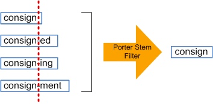
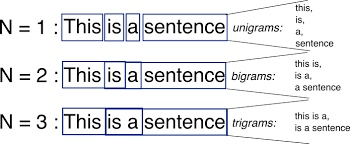
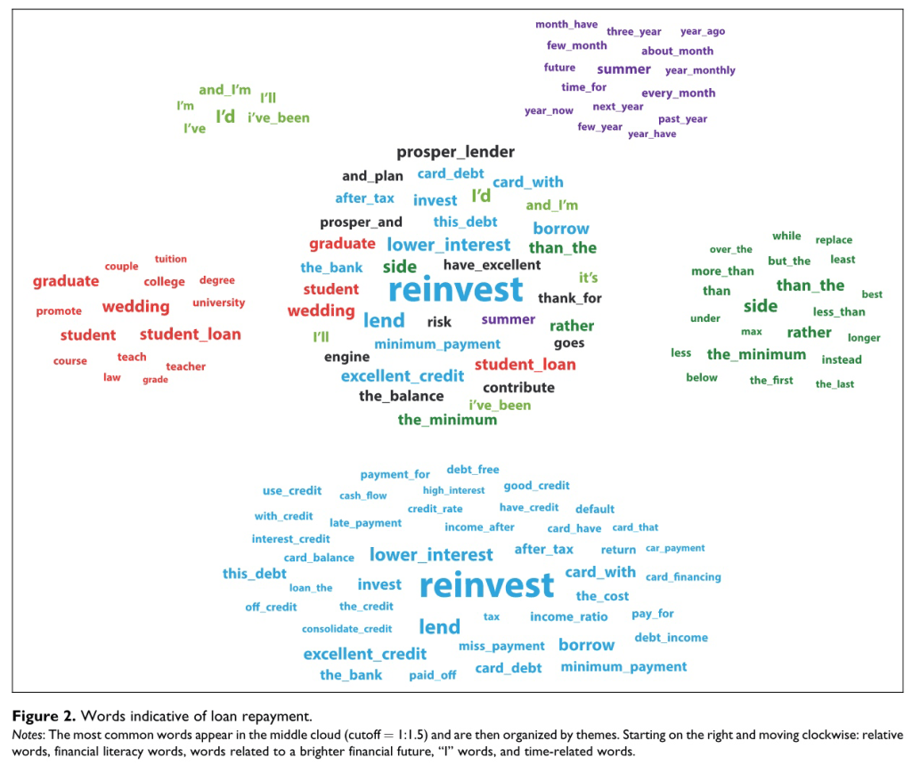
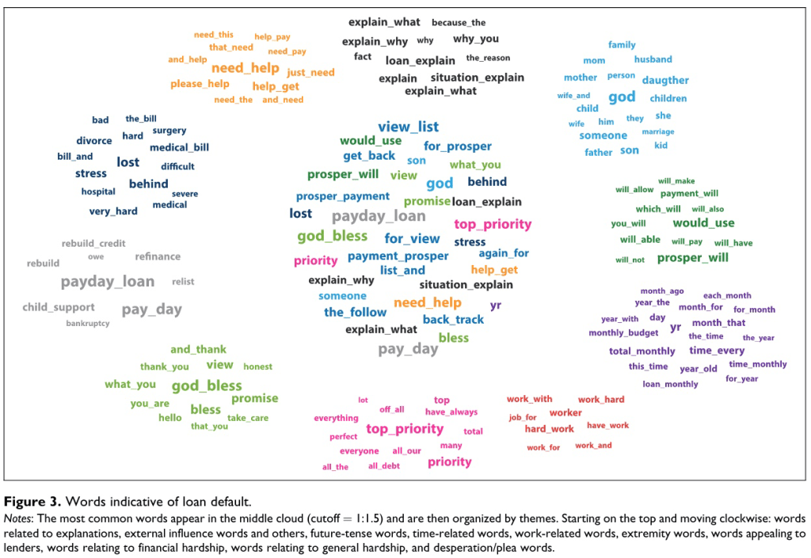

# Lecture 5: 한국어 전처리 (Korean Text Preprocessing) <!-- fit -->

# 텍스트 전처리(Text Preprocessing)

> 텍스트 전처리는 풀고자 하는 문제의 용도에 맞게 텍스트를 사전에 처리하는 작업
> 텍스트 전처리를 제대로 하지 않으면 자연어 처리 기법들이 제대로 동작하지 않음

# 자연어 전처리 과정

- 목적
  - 문서/문장을 의미가 있는 최소 단위로 나누고 분석
- Tokenize
  - 대상이 되는 문서/문장을 최소 단위로 나눔
- Cleaning and Normalization
  - 최소 단위를 표준화
- POS-tagging
  - 최소 의미단위로 나누어진 대상에 대해 품사를 부착
- Chunking
  - POS-tagging의 결과를 명사구, 형용사구, 분사구 등과 같은 말모듬으로 다시 합치는 과정

# 자연어의 분석 단계

자연어처리의 유형

- Lexical (=Morphology) : 단어의 유의미한 성분에 관한 연구
- Syntax : 단어간 구조적 관계에 관한 연구
- Semantics : 문장/단어의 의미론적 연구 (예: 단순 키워드 뿐만 아니라 의도와 문맥까지 파악)
- Pragmatics : 언어를 사용하여 특정한 목표를 달성하기 위한 연구


---

| 원문        | 나는 그 과자를 먹었다.                                                                                      | 너는 그를 사랑하니?                                                                         |
| ----------- | ----------------------------------------------------------------------------------------------------------- | ------------------------------------------------------------------------------------------- |
| 형태소 분석 | 나(대명사) + 는(조사) + 그(대명사) + 과자(명 사) + 먹-(동사)+-었(선어말어미)+- 다(어말 어 미)+ .(문장 부호) | 너(대명사) + 는(조사) + 그(대명사) + 사랑(명사) +-하(동사)+니(어말 어미) + ? (문장부호)     |
| 구문 분석   | (S (NP 나/Noun) 는/Josa (NP 그/Noun 사 과/Noun) 를/Josa (VP 먹었다/Verb)./ Punctuation)                     | (S (NP 너/Noun) 는/Josa (NP 그/Noun) 를/ Josa (NP 사랑/Noun) (VP 하니/Verb) ?/ Punctuation) |
| 의미 분석   | 술부: 먹다 행위자: 나 대상: 그 과자                                                                         | 술부: 사랑하다 행위자: 너 대상: 그                                                          |
| 담화 분석   | 단순 서술                                                                                                   | 의문형                                                                                      |

# 한국어 품사구분

한국어의 5언 9품사

- 단어를 기능 (function), 의미 (meaning), 형태 (form)의 세 가지 기준에 의해 분류함


# 언어형태학적(문법적) 분류

### 고립어, 굴절어 그리고 교착어

- 교착어 (agglutinative): 어근에 접사가 결합되어 각 단어의 기능을 나타내는 언어
- 굴절어 (inflectional): 단어 자체의 형태변화로 그 단어의 문법성을 나타내는 언어
- 고립어 (isolating): 단어의 형태변화 없이 문법적 관계는 어순에 의해 정해지는 언어

### 교착어

- 우랄 알타이어족의 교착어는 단어에 접사가 붙어야 그 뜻이 최종적으로 결정됨
- ex) ‘나’라는 어근에 접사로 ‘은/는/이/가’ 가 붙으면 주격, ‘을/를’ 이라는 접사가 붙으면 목적격
- 동사에서도 어근에 접사가 붙으므로 시제가 결정되는 구조
- ex) ‘가다’는 갔다, 갔었다 라는 어미 변화로 시제가 변화함

---

### 고립어

- 중국 티베트 등이 속한 고립어는 단어 형태는 갖고 어순에 따라 단어의 뜻 결정
- ex) 중국어로 아(我)와 거(去)가 我去라는 어순으로 만나면, ‘나는 가다’ 라는 뜻이 되지만, 어순으로 바꾸어 去我라고 표현하면 ‘나를 가게 하다’ 라는 뜻
- 我와 去라는 단어의 형태는 변하지 않지만, 어떤 순서를 갖는가에 따라 의미 변화
- 중국 티베트어는 단어의 형태는 고립적으로 변하지 않지만, 어순이나 문맥에 따라 단어의 뜻이 달라지게 된다고 하여, 이를 고립어라고 함

---

### 굴절어

- 인도유럽어족의 굴절어는 단어의 형태가 변화하면서 단어의 뜻이 결정되는 언어구조
- 대표적인 굴절어: 라틴어
- 영어의 good이라는 라틴어 단어는 bonus
  - 여기서 접사 -us는 남성, 주격 단수형 어미
  - 만약 이와 다른 속성을 표현하려면 접사를 다른 접사로 대체
  - ex) -um으로 대체하면 bonum: 남성, 직접 목적격 단수(또는 중성 직접 목적격 단수, 중성 주격 단수)
- 굴절어는 격, 성별, 시제 수, 품사 등 단어의 각 요소별로 다른 접사를 붙여 단어의 형태 변화
- 인도, 유럽어는 단어의 형태가 굴절되면서 동시에 단어의 뜻도 변하는 굴절어
- 굴절어는 각 단어가 모두 문법적인 요소를 갖고 있기 때문에 어순의 영향을 크게 받지 않음

# 한국어 품사 분류와 분포(distribution)

한국어 품사 분류의 일반적 기준

> 체언(명사) : 관형사가 그 앞에 올 수 있고 조사가 그 뒤에 올 수 있음
> 용언(동사/형용사) : 부사가 그 앞에 올 수 있고 선어말어미가 그 뒤에 올 수 있고 어말어미가 그 뒤에 와야 함
> 관형사 : 명사가 그 뒤에 와야 함
> 부사 : 용언, 부사, 절이 그 뒤에 와야 함
> 조사 : 체언 뒤에 와야 함
> 어미 : 용언 뒤에 와야 함
> 감탄사(간투사) : 문장 내의 다른 단어와 문법적 관계를 맺지 않고 따로 존재함

`Distributed Representations`

- Neural Network Language Model(Word2Vec, GloVe 등): 학습말뭉치의 단어 분포 정보를 보존하는 방식으로 벡터 생성 $\to$ 임베딩된 단어벡터들이 분포 정보를 내포

# 형태소 분석 (Part of Speech Tagging)

### 형태소 분석이란?

- 문장을 형태소 단위로 구분하고 품사를 구별하여 태깅하고 용언의 다양한 활용으로 인한 형태소 탈락현상을 복원하는 과정
- 분석기마다 형태소 구분 방식이 다르기 때문에 데이터에 맞는 분석기를 선택해야함
- 모든 언어의 자연어 처리과정 중 가장 중요하고 기초적인 역할 수행
- 형태소 분석의 활용
  - 언어학적 측면 : 특정 언어현상의 생성과정을 설명하는 데 용이하게 쓰일 수 있음
  - 전산학적 측면 : 정보검색이나 자연어 처리 자동 처리시스템의 구문 분석의 전 단계 등의 용도로 쓰일 수 있음

---


# Python 한국어 형태소 분석기

### 꼬꼬마 형태소 분석기: Kkma

- 서울대학교 IDS (Intelligent Data Systems) 연구실에서 자연어 처리를 위한 모듈구축과제로 개발한 형태소 분석기
- Java 언어를 기반으로. 하며, Python-Java 연동을 통해 Python에서 사용 가능함
- 동적 프로그래밍 (Dynamic Programming) 방식으로 가능한 모든 형태소 후보를 모두 찾아 가장 적합한 형태소를 판단함 → 매우느림

### 코모란 형태소 분석기: Komoran

- Shineware에서 개발된 한국어 형태소 분석기로서 Java Library 형태(jar)로 제공됨
- 타 형태소 분석기와 달리 여러 어절을 하나의 품사로 분석 가능함으로써 공백이 포함된 고유명사(영화 제목, 음식점 명 등)를 정확하게 분석

---

### Mecab 형태소 분석기: Mecab

- 일본어용 형태소 분석기를 한국어를 사용할 수 있도록 수정
- 사용자 사전 등록기능을 제공하여 댜양한 도메인에서 생성되는 단어들을 인식할 수 있도록 도와줌

### 한나눔 형태소 분석기: Hannanum

- KAIST Semantic Web Research Center (SWRC)에서 개발한 형태소 분석기
- 자동 띄어쓰기 모듈을 제공해 형태소 분석 결과를 활용하여 한글 문장에 대한 자동 띄어쓰기 수행 가능
- 사전 기반의 맞춤법 교정 모듈로 형태소 분석 결과를 활용하여 한글 단어에 대한 맞춤법 교정 수행 가능

---

### Khaiii (Kakao Hangul Analyzer III)

- 카카오에서 DHA2 (Daumkakao Hangul Analyzer 2)를 계승하여 개발하고 2018년 공개된 두 번째 버전의 형태 소분석기
- 속도를 매우 중요시하여 신경망 알고리즘들 중에서 Convolutional Neural Network (CNN)을 사용하여 개발됨
- 사용자 사전 등록기능을 제공하여 댜양한 도메인에서 생성되는 단어들을 인식할 수 있도록 도와줌

### 오픈 소스 한국어 분석기: Open Korean Text (Okt)

- 과거 트위터 형태소 분석기 (Twitter)
- SNS에서 발생하는 언어에서 자주 발생하는 인물명, 신조어 등을 잘 인식하는 편이며, 속도가 빠르지만 형태소 분석 품질은 상대적으로 낮음

# Dictionary based Part of Speech Tagger

품사 판별은 텍스트 데이터 분석을 위한 전처리 과정 중 하나

```
한편 IMF가 추정한 우리나라의 GDP갭률은 금년에도 소폭의 마이너스(-)를 지속하고 있는데, 잠재성장률 추정의 불확실성을
감안하더라도 최근의 고용상황, 제조업가동률, 물가상승률 등에 비추어 볼 때 동 추정치가 어느 정도 타당성이 있어 보인다고
언급하면서 관련부서의 견해를 물었음.
```

```python
from konlpy.tag import Kkma
kkma = Kkma()
kkma.pos(text)
```

```
[('한편', 'NNG'), ('IMF', 'OL'), ('가', 'JKS'), ('추정', 'NNG'), ('하', 'XSV'), ('ㄴ', 'ETD'),
('우리나라', 'NNG'), ('의', 'JKG'), ('GDP', 'OL'), ('갭', 'NNG'), ('률', 'XSN'), ('은', 'JX'),
('금년', 'NNG'), ('에', 'JKM'), ('도', 'JX'), ('소폭', 'NNG'), ('의', 'JKG'), ('마이너스', 'NNG'),
('(', 'SS'), ('-', 'SW'), (')', 'SS'), ('를', 'JKO'), ('지속', 'NNG'), ('하', 'XSV'), ('고', 'ECE'),
('있', 'VXV'), ('는데', 'ECD'), (',', 'SP'), ('잠재', 'NNG'), ('성장률', 'NNG'), ('추정', 'NNG'),
('의', 'JKG'), ('불확실', 'NNG'), ('성', 'XSN'), ('을', 'JKO'), ('감안', 'NNG'), ('하', 'XSV'),
('더라도', 'ECD'), ('최근', 'NNG'), ('의', 'JKG'), ('고용', 'NNG'), ('상황', 'NNG'), (',', 'SP'),
('제조업', 'NNG'), ('가동률', 'NNG'), (',', 'SP'), ('물가', 'NNG'), ('상승률', 'NNG'), ('등', 'NNB'),
('에', 'JKM'), ('비추', 'VV'), ('어', 'ECD'), ('보', 'VV'), ('ㄹ', 'ETD'), ('때', 'NNG'), ('동', 'NNG'),
('추', 'NNG'), ('정치', 'NNG'), ('가', 'JKS'), ('어느', 'MDT'), ('정도', 'NNG'), ('타당성', 'NNG'),
('이', 'JKS'), ('있', 'VV'), ('어', 'ECD'), ('보이', 'VV'), ('ㄴ다고', 'ECE'), ('언급', 'NNG'), ('하', 'XSV'),
('면서', 'ECE'), ('관련', 'NNG'), ('부서', 'NNG'), ('의', 'JKG'), ('견해', 'NNG'), ('를', 'JKO'),
('묻', 'VV'), ('었', 'EPT'), ('음', 'ETN'), ('.', 'SF')]
```

# 품사 판별 과 형태소 분석

- 품사 판별을 위하여 형태소 분석 이용 가능
- 형태소 분석은 단어의 구성 요소들을 분해하여 인식하는 과정
- 품사 사전이 잘 구축된다면, 사전기반으로도 품사판별 가능
- 품사 판별이 목적이라면 형태소분석 과정이 필수 아님
- 사전 기반으로 작동하는 형태소/품사 분석은 사전 구성이 핵심
- 좋은 품질을 위하여 사용자 사전을 추가하여 사용

# 통계 기반 단어/품사 추정


# 품사 판별

1. 후보 생성

- 사전을 이용하여 문장에서 가능한 품사열 후보 생성
- 가능성이 적은 후보들을 제거

2. 후보 평가

- 후보들 중에서 가장 적절한 품사열을 선택

3. 후처리

- 사전에 포함되지 않는 단어들 처리 및 그 외의 후처리를 수행

# Max Score Tokenizer

알고 있는 단어부터 품사 판별

- 긴 문장이 주어지면 사람은 아는 단어부터 눈에 보임
- 확신이 있는 단어부터 품사를 판별

```python
from soynlp.tokenizer import MaxScoreTokenizer

scores = {'파스': 0.3, '파스타': 0.7, '좋아요': 0.2, '좋아':0.5}
tokenizer = MaxScoreTokenizer(scores=scores)

print(tokenizer.tokenize('난파스타가좋아요'))
# ['난', '파스타', '가', '좋아', '요']

print(tokenizer.tokenize('난파스타가 좋아요', flatten=False))
# [[('난', 0, 1, 0.0, 1), ('파스타', 1, 4, 0.7, 3),  ('가', 4, 5, 0.0, 1)],
#  [('좋아', 0, 2, 0.5, 2), ('요', 2, 3, 0.0, 1)]]
```

# 한국어 용언의 활용 (Conjugation)


# 활용과 원형 복원

### Lemmatization vs Conjugation

- lemmatization: 주어진 용언에서 어간과 어미의 원형을 찾는 작업
  lemmatize(‘한다’) $\to$ `‘하 + ㄴ다‘`
- conjugation: 어간과 어미의 원형이 주어졌을 때 적절한 모양으로 용언을 변형시키는 작업
  conjugate(‘하’, ‘ㄴ다‘) $\to$ `‘한다’`

# Lemmatization

### 규칙 기반 원형 복원 (lemmatization)

규칙 기반으로 형태소 후보를 만든 뒤, 형태소 사전을 검색


# Lemmatization

### 음절 단위의 사전 기반 원형 복원

단어의 모든 부분에 대하여 형태소 후보를 생성한 뒤, 사전을 확인


# Out of vocabulary

말뭉치 기반으로 학습된 한국어 토크나이저 문제점

- 미등록단어 문제 발생 가능
- 분석의 주요 단어가 제대로 인식되지 않으면 키워드 추출이나 토픽 모델링의 품질 저하

```python
from konlpy.tag import Kkma, Twitter
kkma = Kkma()
kkma.pos(‘너무너무너무는 아이오아이의 노래에요‘)
```

너무/MAG, 너무너무/MAG, 는/JX, 아이오/NNG, 아이/NNG, 의/JKG, 노래/NNG, 에/JKM, 요/JX

```python
twitter = Twitter()
twitter.pos(‘너무너무너무는 아이오아이의 노래에요‘)
```

너무/Noun, 너무/Noun, 너무/Noun, 는/Josa, 아이오/Noun, 아이/Noun, 의/Josa, 노래/Noun, 에요/Josa

# 한국어의 특성 1

> 의미를 지니는 단어는 어절의 왼쪽에 등장

- 명사, 동사, 형용사, 부사, 감탄사 : 의미를 지니는 단어
- 조사, 어미 : 문법 기능의 단어와 형태소

> ex)

- 발표/명사 + 를/조사
- 하/동사어근 + 면서/어미

# 한국어의 특성 2

> 어절의 다양성은 문법 기능을 하는 단어에 의하여 발생

- 문법 기능을 하는 단어를 어절에서 분리하면 분리된 단어의 종류는 적음
- 새롭게 만들어지는 단어는 주로 의미를 지니는 부분

> ex)

- [명사 + 조사]: **발표**+를, **발표**+에서, **발표**+도, …
- [동사/형용사 +어미]: **하**+면서, **하**+고, **하**+니까

# 한국어의 특성 3

> 한국어 어절의 형태는 `L + [R]`

- 복합형태소는 하나의 R 로 생각하면 어절 구조가 단순해짐

> ex)

- 수업하는데 = **수업**/명사+ **하**/동사파생접미사 + **는데**/어미
- 수업하는데 = **수업**/L+ **하는데**/R

> 단어 추출은 어절에서 의미를 지니는 부분인 L을 인식하는 것이며, 토크나이징은 어절을 L + [R] 로 나누는 것

# Unsupervised Word Extraction: Cohesion (Character n-gram) <!--fit-->

맥락이 충분히 주어지지 않으면 다음에 등장할 글자의 확률 낮음

- 한글자 (‘아‘)는 매우 모호한 문맥


# Cohesion (Character n-gram)

맥락이 충분히 주어지지 않으면 다음에 등장할 글자의 확률 낮음


# Cohesion (Character n-gram)

Subword 다음에 등장할 글자가 쉽게 예상된다면 (확률이 높다면) 아직 단어가 끝나지 않았다는 의미



# Cohesion (Character n-gram)

Subword 다음에 등장할 글자가 쉽게 예상된다면 (확률이 높다면) 아직 단어가 끝나지 않았다는 의미


# Cohesion (Character n-gram)

Cohesion Score


# Cohesion (Character n-gram)

하루치 뉴스로부터 학습한 결과


# L-Tokenizer

어절의 왼쪽에서부터 단어의 점수가 가장 큰 subword를 기준으로 어절 구분

```python
def ltokenize(w):
  n = len(w)
  if n <= 2: return (w, '')
  tokens = []
  for e in range(2, n+1):
    tokens.append(w[:e], w[e:], cohesion(w[:e]))
  tokens = sorted(tokens, key=lambda x:-x[2])
  return tokens[0][:2]

sent = '뉴스의 기사를 이용했던 예시입니다'
for word in sent.split():
  print( ltokenize(word) )
```

('뉴스', '의') ('기사', '를') ('이용', '했던') ('예시', '입니다')

# Unsupervised Word Extraction: Branching Entropy

단어의 경계 부분에서는 다음 글자의 불확실성 증가

- 연속된 글자의 각 부분에서 다음 글자의 불확실성을 `entropy`로 정의



# Branching Entropy

`Entropy`는 확률 분포의 불확실성을 정의하는 방법

> Prob: {a: 0.99, b: 0.005, c: 0.005} 에서 임의의 한 개를 선택했을 때 대부분 a가 확실

$$ Entropy = - { 0.99 _ log(0.99) + 0.005 _ log(0.005) + 0.005 \* log(0.005) } = 0.063 $$

> Prob: {a: 0.3, b: 0.4, c: 0.3} 에서 임의의 한 개를 선택하면 어떤 글자가 등장할지 예상하기 어려움. 불확실성 큼.

$$ Entropy = - { 0.3 _ log(0.3) + 0.4 _ log(0.4) + 0.3 \* log(0.3) } = 1.089 $$

# Branching Entropy

`불확실성`으로 `단어의 경계`를 표현: 불확실성은 `Entropy`를 이용하여 수치화



# Branching Entropy

`불확실성`으로 `단어의 경계`를 표현: 불확실성은 `Entropy`를 이용하여 수치화


# Branching Entropy

`불확실성`으로 `단어의 경계`를 표현: 불확실성은 `Entropy`를 이용하여 수치화


# Branching Entropy

`불확실성`으로 `단어의 경계`를 표현: 불확실성은 `Entropy`를 이용하여 수치화


# Branching Entropy

단어의 경계를 넘으면 다음 글자에 대한 `불확실성` 다시 `증가`


# Branching Entropy

- `아이`가 다양한 단어의 subword 여서 Branching Entropy가 큼
- `Cohesion`, `Branching Entropy` 활용 토크나이저
  Branching Entropy가 다음 글자에서 떨어지는 부분들 중에서 Cohesion이 가장 큰 부분 선택


# Branching Entropy

Accessor Variety는 경계에 등장하는 글자의 종류수로 단어 점수를 표현

- AV 와 BE는 중국어/일본어의 word segmentation에서 자주 이용


# 단어 추출

### 통계 기반 단어 추출 방법은 exterior / interior score 로 분류

- Cohesion 은 단어 내 글자의 연관성을 단어 점수로 이용 (interior)
- Branching Entropy 는 단어 좌/우의 다른 글자를 이용하여 단어 점수를 정의 (exterior)
- 두 방법은 더 서로 다른 종류의 정보를 이용

### 단어 추출은 문서 집합의 도메인이 homogeneous 할 때 잘 작동

- 통계 기반 방법은 패턴이 잘 드러날 때 유리
- 아프리카 내전과 관련된 문서집합이었다면 ‘카메룬’의 cohesion은 ‘카메라‘ 보다 높았을 것
  (tip) 가능한 분석할 문서의 종류를 나눠놓은 뒤 단어 추출을 수행

# Packages

```python
from soynlp import DoublespaceLineCorpus
from soynlp.word import WordExtractor

corpus = DoublespaceLineCorpus(fname, iter_sent=True)
word_extractor = WordExtractor(corpus, min_count=10)
words = word_extractor.extract()
words['드라마']
```

```python
Scores(cohesion_forward=0.6093651029086764,
      cohesion_backward=0.5282705437953743,
      left_branching_entropy=3.6583115265560924,
      right_branching_entropy=3.675624807575614,
      left_accessor_variety=128,
      right_accessor_variety=136,
      leftside_frequency=2375,
      rightside_frequency=1284)
```

# Packages

https://github.com/lovit/soynlp 에 단어추출/명사추출/토크나이저를 구현

```python
from soynlp.tokenizer import LTokenizer

scores = {word:score.cohesion_forward for word, score in word_score.items()}
l_tokenizer = LTokenizer(scores=scores)

l_tokenizer.tokenize("안전성에 문제있는 스마트폰을 휴대하고 탑승할 경우에 압수한다", flatten=False)
```

```python
[('안전', '성에'),
 ('문제', '있는'),
 ('스마트폰', '을'),
 ('휴대', '하고'),
 ('탑승', '할'),
 ('경우', '에'),
 ('압수', '한다')]
```

# Packages

```python
from soynlp.tokenizer import MaxScoreTokenizer

maxscore_tokenizer = MaxScoreTokenizer(scores=scores)
maxscore_tokenizer.tokenize("안전성에문제있는스마트폰을휴대하고탑승할경우에압수한다")
```

```python
['안전',
 '성에',
 '문제',
 '있는',
 '스마트폰',
 '을',
 '휴대',
 '하고',
 '탑승',
 '할',
 '경우',
 '에',
 '압수',
 '한다']
```

# Sentence Segmentation: NLTK

```python
text = "For strains harboring the pYV plasmid and Yop-encoding plasmids, bacteria were grown with
aeration at 26 °C overnight in broth supplemented with 2.5 mm CaCl2 and 100 μg/ml ampicillin and
then subcultured and grown at 26 °C until A600 of 0.2. At this point, the cultures were shifted to
37 °C and aerated for 1 h. A multiplicity of infection of 50:1 was used for YPIII(p-) incubations,
and a multiplicity of infection of 25:1 was used for other derivatives. For the pYopE-expressing
plasmid, 0.1 mm isopropyl-β-d-thiogalactopyranoside was supplemented during infection to induce
YopE expression."
```

```python
from ekorpkit.preprocessors.segmenter import NLTKSegmenter
seg = NLTKSegmenter()
print(seg.segment(text))
```

```
['For strains harboring the pYV plasmid and Yop-encoding plasmids, bacteria were grown with
aeration at 26 °C overnight in broth supplemented with 2.5 mm CaCl2 and 100 μg/ml ampicillin and
then subcultured and grown at 26 °C until A600 of 0.2.',
'At this point, the cultures were shifted to 37 °C and aerated for 1 h. A multiplicity of
infection of 50:1 was used for YPIII(p-) incubations, and a multiplicity of infection of 25:1 was
used for other derivatives.',
'For the pYopE-expressing plasmid, 0.1 mm isopropyl-β-d-thiogalactopyranoside was supplemented
during infection to induce YopE expression.']
```

# Sentence Segmentation: PySBD

```ptyhon
from ekorpkit.preprocessors.segmenter import PySBDSegmenter
seg = PySBDSegmenter()
print(seg.segment(text))
```

```
['For strains harboring the pYV plasmid and Yop-encoding plasmids, bacteria were grown with
aeration at 26 °C overnight in broth supplemented with 2.5 mm CaCl2 and 100 μg/ml ampicillin and
then subcultured and grown at 26 °C until A600 of 0.2. ',
'At this point, the cultures were shifted to 37 °C and aerated for 1 h. ',
'A multiplicity of infection of 50:1 was used for YPIII(p-) incubations, and a multiplicity of
infection of 25:1 was used for other derivatives. ',
'For the pYopE-expressing plasmid, 0.1 mm isopropyl-β-d-thiogalactopyranoside was supplemented
during infection to induce YopE expression.']
```

# Sentence Segmentation: KSS

```python
text = "일본기상청과 태평양지진해일경보센터는 3월 11일 오후 2시 49분경에 일본 동해안을 비롯하여 대만, 알래스카, 하와이, 괌,
캘리포니아, 칠레 등 태평양 연안 50여 국가에 지진해일 주의보와 경보를 발령하였다. 다행히도 우리나라는 지진발생위치로부터
1,000km 이상 떨어진데다 일본 열도가 가로막아 지진해일이 도달하지 않았다. 지진해일은 일본 소마항에 7.3m, 카마이시항에 4.1m,
미야코항에 4m 등 일본 동해안 전역에서 관측되었다. 지진해일이 원해로 전파되면서 대만(19시 40분)에서 소규모 지진해일과 하와이
섬에서 1.4m(23시 9분)의 지진해일이 관측되었다. 다음날인 3월 12일 새벽 1시 57분경에는 진앙지로부터 약 7,500km 떨어진
캘리포니아 크레센트시티에서 2.2m의 지진해일이 관측되었다."
```

```python
from ekorpkit.preprocessors.segmenter import KSSSegmenter
seg = KSSSegmenter(backend='None')
print(seg.segment(text))
```

```
['일본기상청과 태평양지진해일경보센터는 3월 11일 오후 2시 49분경에 일본 동해안을 비롯하여 대만, 알래스카, 하와이, 괌,
캘리포니아, 칠레 등 태평양 연안 50여 국가에 지진해일 주의보와 경보를 발령하였다.',
'다행히도 우리나라는 지진발생위치로부터 1,000km 이상 떨어진데다 일본 열도가 가로막아 지진해일이 도달하지 않았다.',
'지진해일은 일본 소마항에 7.3m, 카마이시항에 4.1m, 미야코항에 4m 등 일본 동해안 전역에서 관측되었다.',
'지진해일이 원해로 전파되면서 대만(19시 40분)에서 소규모 지진해일과 하와이 섬에서 1.4m(23시 9분)의 지진해일이 관측되었다.',
'다음날인 3월 12일 새벽 1시 57분경에는 진앙지로부터 약 7,500km 떨어진 캘리포니아 크레센트시티에서 2.2m의 지진해일이 관측되었다.']
```
