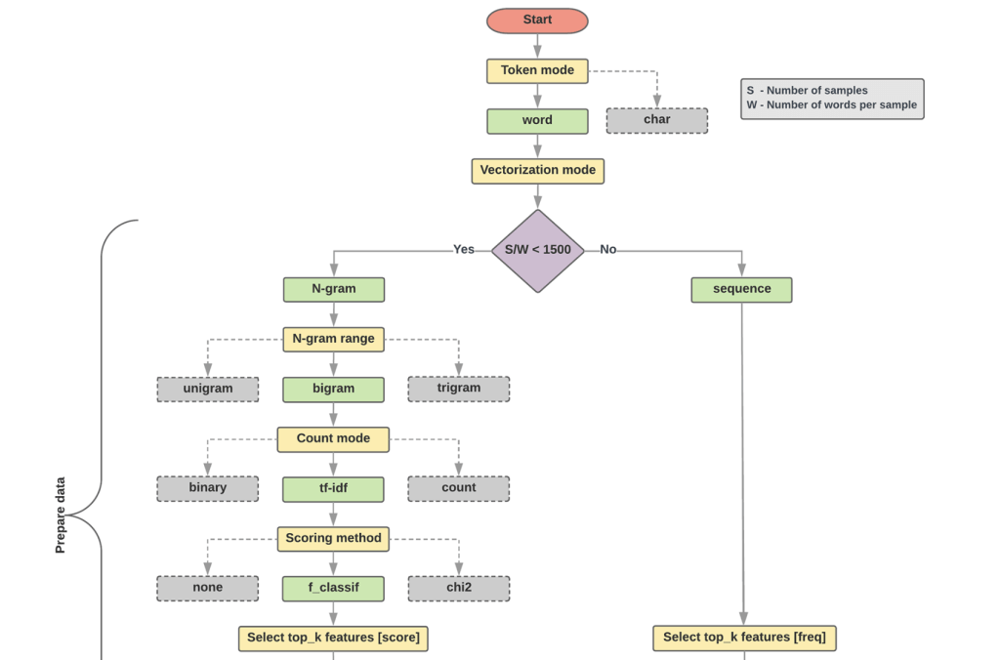

## What are N-grams?

- N-grams are contiguous sequences of n tokens.
  - Bigrams: 2-grams
  - Trigrams: 3-grams
  - Quadgrams: 4-grams
- Google Developers recommend tf-idf-weighted bigrams as a baseline for text classification.

For example, the sentence “The quick brown fox jumps over the lazy dog” has the following bigrams:

> [“The quick”, “quick brown”, “brown fox”, “fox jumps”, “jumps over”, “over the”, “the lazy”, “lazy dog”]

for trigrams:

> [“The quick brown”, “quick brown fox”, “brown fox jumps”, “fox jumps over”, “jumps over the”, “over the lazy”, “the lazy dog”]

**Text classification flowchart (from Google Developers):**



### N-grams and high dimensionality

- N-grams will blow up your feature space:
  - 1-grams: 1000 words → 1000 features
  - 2-grams: 1000 words → 500,500 features
- Filtering out low-frequency and uninformative n-grams is important.
- Google Developers say that a feature space of 20,000 features will work well for descriptive and predictive text classification.

### Hashing Vectorizer

Rather than make a one-to-one lookup for each n-gram, put n-grams through a hashing function that takes an arbitrary string and outputs an integer in some range (e.g. 1 to 10,000).

- This is a lossy transformation, but it can be useful for very large feature spaces.
- The hashing function is deterministic, so the same string will always map to the same integer.


```python
from sklearn.feature_extraction.text import HashingVectorizer

vectorizer = HashingVectorizer(
    n_features=2**4, stop_words="english", alternate_sign=False
)

X = vectorizer.transform(twenty_train.data)

print(X.shape)
```

### Collocations

Collocations are phrases that occur together more often than would be expected by chance.

- Non-compositional: the meaning is not the sum of the parts
  > e.g., “New York” is not the sum of “New” and “York”
- Non-substitutable: cannot substitute one component with synonyms
  > e.g., “fast food” is not the same as “quick food”
- Non-modifiable: cannot modify with additional words
  > e.g., “kick around the bucket” is not the same as “kick the bucket around”

### Pointwise Mutual Information

- Pointwise Mutual Information (PMI) is a measure of how often two words co-occur in a corpus.
- PMI is defined as:

$$
PMI(w_1,w_2) = \frac{P(w_1\_ w_2)}{P(w_1)P(w_2)} \\
= \frac{\text{Prob. of collocation, actual}}{\text{Prob. of collocation, if independent}}
$$

where $w_1$ and $w_2$ are words in the vocabulary, and $w_1$, $w_2$ is the N-gram $w_1\_w_2$.
ranks words by how often they collocate, relative to how often they occur apart.

- Generalizes to longer phrases (length N) as the geometric mean of the probabilities:

$$ \frac{P(w*1,\ldots w_2 )}{\prod*{i=1}^{n} \sqrt[n]{P(w_i)}} $$

- Caveat: Rare words will have high PMI, but this is not necessarily a good thing.
  - Can use a threshold to filter out rare words.

### Out-of-Vocabulary Words (OOV) for N-grams

- OOV words are words that are not in the vocabulary.
- OOV words are a problem for N-gram models.
  - Can be replaced with a special token, e.g. `<UNK>`.
  - Can be replaced with the POS tag, e.g. `<NOUN>`.
  - Can be replaced with the hypernym, e.g. `<ANIMAL>`.
  - Can use a hash function to map OOV words to a fixed number of buckets.
